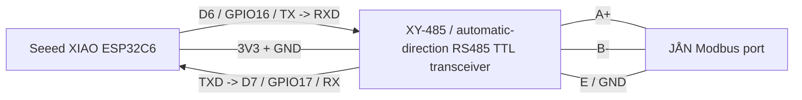

# Wiring

This project uses a Seeed Studio XIAO ESP32C6 with an automatic-direction RS485-to-TTL transceiver such as the common `XY-485` board. The Adlar/JÅN side exposes a Modbus/RS485 port with `A`, `B` and `GND`.

The Aurora III community setups found online connect the RS485 adapter in parallel with the existing JÅN/internal Modbus wiring. In other words: leave the existing heat-pump/JÅN wires in place and tap the same `A`, `B` and `GND` terminals.

## Minimal Diagram



## XIAO To XY-485 TTL Side

Use the printed labels on the PCB. Do not rely only on wire colors.

| XIAO ESP32C6 | GPIO | XY-485 board |
| --- | ---: | --- |
| D6 / TX | GPIO16 | RXD |
| D7 / RX | GPIO17 | TXD |
| 3V3 |  | VCC / UCC |
| GND |  | GND / DNG |

The XY-485 board handles RS485 transmit/receive direction automatically. Leave `D2` disconnected and do not configure `flow_control_pin` in ESPHome.

If you use a basic manual-direction MAX485 module instead, tie `DE` and `/RE` together, connect them to `D2`, and add this to the `modbus:` block:

```yaml
flow_control_pin: D2
```

## RS485 Side

| XY-485 board | JÅN Modbus port |
| --- | --- |
| A+ | A |
| B- | B |
| E / GND | GND |

Some RS485 adapters label `A` and `B` opposite to the device. If the ESP boots and logs show Modbus timeouts, swap `A` and `B` as an early test.

On many XY-485 boards, the third screw terminal is marked `E` or with an earth symbol. Use it for the JÅN `GND` terminal, and verify with a multimeter whether it is connected to the TTL-side `GND/DNG`. If it is not common with TTL ground, add a proper signal-ground connection between the JÅN `GND` and the transceiver ground.

For a permanent parallel tap, avoid two loose bare wires under one screw. Use ferrules, a small junction terminal, or a WAGO-style connector so the original JÅN connection remains mechanically reliable.

## Electrical Notes

- Power the XY-485 board from `3V3` so its TTL side is compatible with the XIAO ESP32C6.
- Do not feed a 5V TTL output into the XIAO RX pin.
- Wire with power off.
- Keep the cable short for first tests.
- For longer cable runs, use twisted pair for `A/B` and consider proper RS485 termination and biasing.
- Connect signal ground (`GND`) between the RS485 transceiver and JÅN port.
- Trim or insulate unused shield strands. They must not touch terminals or the PCB.

## Bus Ownership

ESPHome is an additional Modbus client/master. RS485 is electrically multi-drop, but Modbus RTU does not provide true collision avoidance. This project therefore uses slow polling, grouped register reads and disabled-by-default write controls. Start read-only and watch for timeouts or CRC errors before enabling controls.
