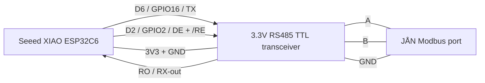

# Wiring

This project uses a Seeed Studio XIAO ESP32C6 with a 3.3V RS485-to-TTL transceiver. The Adlar/JÅN side exposes a Modbus/RS485 port with `A`, `B` and `GND`.

## Minimal Diagram



## XIAO To RS485 TTL Side

| XIAO ESP32C6 | GPIO | RS485 TTL module |
| --- | ---: | --- |
| D6 / TX | GPIO16 | DI / TX-in |
| D7 / RX | GPIO17 | RO / RX-out |
| D2 | GPIO2 | DE and /RE tied together |
| 3V3 |  | VCC, only for a 3.3V transceiver |
| GND |  | GND |

If your RS485 module has automatic direction control, remove this line from the YAML:

```yaml
flow_control_pin: D2
```

## RS485 Side

| RS485 TTL module | JÅN Modbus port |
| --- | --- |
| A | A |
| B | B |
| GND | GND |

Some RS485 adapters label `A` and `B` opposite to the device. If the ESP boots and logs show Modbus timeouts, swap `A` and `B` as an early test.

## Electrical Notes

- Use a 3.3V RS485 transceiver. Do not feed a 5V TTL `RO` output into the XIAO RX pin.
- Wire with power off.
- Keep the cable short for first tests.
- For longer cable runs, use twisted pair for `A/B` and consider proper RS485 termination and biasing.
- Connect signal ground (`GND`) between the RS485 transceiver and JÅN port.

## Bus Ownership

ESPHome is the Modbus master/client. That is fine if the JÅN port behaves as a Modbus slave/server interface. If the ESP is placed on an existing bus where another master is already polling, collisions can happen. Start with slow read-only polling and watch the logs before enabling write controls.
